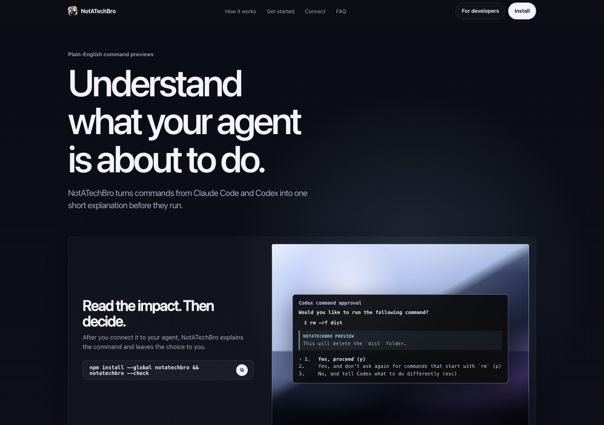

<p align="center">
  
</p>

<h1 align="center">NotATechBro</h1>

<p align="center">
  Plain-English previews for agentic CLI commands before they run.
</p>
<p align="center">
  <a href="https://github.com/r4mielCEO/notatechbro/actions/workflows/ci.yml"></a>
  <a href="LICENSE"></a>
</p>

<p align="center">
  <a href="https://r4mielceo.github.io/notatechbro/">Website</a>
  ·
  <a href="docs/quickstart.html">Quickstart</a>
  · <a href="docs/cli-adapters.html">Adapters</a>
  · <a href="docs/safety-and-ux.html">Safety wording</a>
  · <a href="docs/architecture.html">Architecture</a>
</p>

<p align="center">
  
</p>

NotATechBro is a small local CLI that explains agentic CLI tool calls before they run. It is built for people who are new to agentic coding and do not want to approve commands they cannot read.

Instead of showing only this:

```bash
rm -rf dist
```

it prints this:

```text
This will delete the `dist` folder.
```

The primary executable is `notatechbro`. The older `change-preview` command remains available as a backwards-compatible alias.

## Why it exists

Agentic coding tools often ask for permission with a raw command. That is fine for developers. It is not fine for everyone else.

NotATechBro adds a local explanation layer between the agent's request and the user's approval moment. It explains the likely impact in one sentence, then gets out of the way.

## What it does not do

- It does not block commands.
- It does not approve commands.
- It does not send commands, paths, or file contents to a server.
- It does not require an LLM at runtime.
- It does not claim that a command is safe.

## Supported MVP integrations

The CLI reads hook JSON on stdin and normalizes common payloads from:

- Claude Code `PreToolUse` command hooks
- Hermes `pre_tool_call` shell hooks
- Codex CLI 0.134+ `PreToolUse` command hooks, plus permissive support for older `shell` / `tool_call` payload shapes
- generic tool payloads with `tool_name` and `tool_input`

Human preview text goes to stderr by default so stdout stays available for hook protocols.

## Install

```bash
npm install --global notatechbro
notatechbro --check
```

Expected result:

```text
NotATechBro 0.1.0 is installed and ready.
Example: This will run this project's tests.
```

Want to try it without installing globally?

```bash
npx notatechbro@latest --check
```

Then test the executable:

```bash
echo '{"tool_name":"Bash","tool_input":{"command":"rm -rf dist"}}' | notatechbro
```

Backwards-compatible alias:

```bash
echo '{"tool_name":"Bash","tool_input":{"command":"rm -rf dist"}}' | change-preview
```

Expected stderr:

```text
This will delete the `dist` folder.
```

For local development from this checkout:

```bash
echo '{"tool_name":"Bash","tool_input":{"command":"npm install"}}' | npm run dev
```

Run `notatechbro --help` at any time for the short command reference.

## JSON mode

Some hook systems expect structured stdout. Use `--json`:

```bash
echo '{"tool_name":"Bash","tool_input":{"command":"git push"}}' | notatechbro --json
```

Output:

```json
{"preview":"This will upload your local commits to the remote repository.","confidence":"high","risk":"medium"}
```

JSON mode reports the preview and metadata only. It does not approve, deny, block, or mutate tool calls.

## Quiet mode

Suppress low-value read-only previews:

```bash
echo '{"tool_name":"read_file","tool_input":{"path":"README.md"}}' | notatechbro --quiet
```

## Library API

The deterministic engine can also be reused from TypeScript or JavaScript:

```ts
import { explainAction, normalizeCodexPayload } from "notatechbro";

const action = normalizeCodexPayload({
  tool_name: "exec_command",
  tool_input: { cmd: "npm test" },
});

console.log(explainAction(action).message);
// This will run this project's tests.
```

The package root exports the shared normalizer and dedicated Claude, Codex, Hermes, and generic adapter entrypoints.

## Examples

```bash
echo '{"tool_name":"Bash","tool_input":{"command":"rm -rf build && npm install"}}' | notatechbro
# This will delete the `build` folder, then install or update this project's JavaScript packages.

echo '{"hook_event_name":"pre_tool_call","tool_name":"terminal","tool_input":{"command":"git clean -fd"}}' | notatechbro
# This may permanently delete untracked files from the project.

echo '{"tool_name":"Write","tool_input":{"file_path":"src/app.ts"}}' | notatechbro
# This will write or overwrite `src/app.ts`.
```

## Website and docs

The static landing page lives at `docs/landing.html`.

The polished HTML docs are meant for normal users:

- `docs/quickstart.html`
- `docs/cli-adapters.html`
- `docs/safety-and-ux.html`
- `docs/architecture.html`

The Markdown files remain the source docs for GitHub:

- `README.md`
- `docs/cli-adapters.md`
- `docs/safety-and-ux.md`
- `docs/architecture.md`
- `docs/hook-verification.md`

## Contributing

Contributions are welcome. Forks, experiments, alternate branches, and opinionated versions are welcome too.

Good first contributions include:

- better explanations for common commands
- new command families
- real hook payloads from agent CLIs
- adapter examples for more tools
- docs and setup improvements

Start with [`CONTRIBUTING.md`](CONTRIBUTING.md). Please keep the project local-first, observer-only, and understandable for non-technical users.

Community files:

- [`CONTRIBUTING.md`](CONTRIBUTING.md)
- [`CODE_OF_CONDUCT.md`](CODE_OF_CONDUCT.md)
- [`SECURITY.md`](SECURITY.md)
- [`SUPPORT.md`](SUPPORT.md)

## Hook verification status

This checkpoint includes adapter smoke tests against representative Claude Code, Hermes, and Codex payloads. See `docs/hook-verification.md` for the exact inputs, outputs, and remaining caveats.

Codex CLI 0.134+ `PreToolUse` config and payload shape are documented and covered by adapter tests. A full interactive Codex hook run with hook trust accepted is still the final end-to-end check.

## Development

```bash
npm install
npm run test
npm run lint
npm run typecheck
npm run build
```

Project shape:

```text
src/
  adapters/         # Claude/Codex/Hermes/generic adapter entrypoints
  core/             # normalized action model, normalization, explanation entrypoint
  rules/            # shell and file-operation explanation rules
  cli.ts            # stdin/stdout/stderr executable
docs/
  landing.html      # static landing page
  *.html            # polished user-facing docs pages
  *.md              # GitHub/source docs
  assets/           # icon and website preview assets
examples/
  claude-code-settings.json
  hermes-config.yaml
  codex-config.toml
```

## Current verification

This checkpoint passes:

```bash
npm run test
npm run lint
npm run typecheck
npm run build
```

## Product direction

The core local preview tool should remain free/open-source. Paid features, if they ever exist, belong in team/governance layers: policy packs, audit logs, managed config, enterprise integrations, or optional private LLM summaries.
